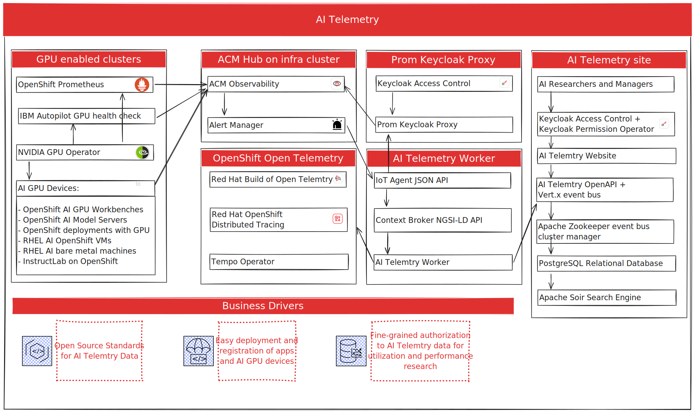
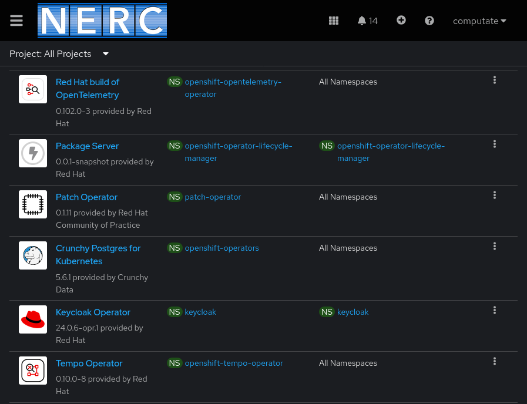
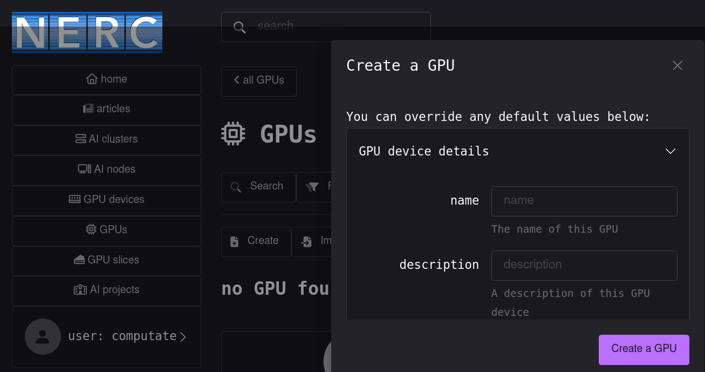
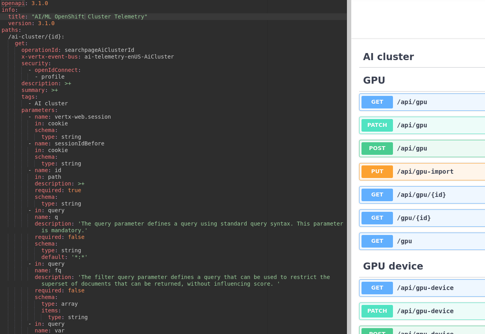

# AI Telemetry

Objective: Performance introspection/telemetry for AI optimization

Initiative: Build a distributed, optimized AI/ML platform from the MOC baseline

## Use case

Develop a platform for reporting on AI/ML cluster and GPU device usage data 
and performing telemetry on AI/ML workloads through a secure dashboard and API. 

## Background

The New England Research Cloud is a perfect environment for AI/ML related research.
We wish to help researchers and managers of GPU devices in the New England Research Cloud (NERC) 
shared computing environment understand how the valueable and limited GPU resources are being utilized. 
We will provide access to researchers and managers through Keycloak and GitHub as identity provider 
to access the AI Cluster data and research project GPU allocation telemetry through a modern open source platform 
that will be built for the MOC and usable by other organizations wishing to collect the same telemetry. 
Other Red Hat associates outside of Red Hat Research have also been invited to participate 
in building the platform through the Red Hat Internal Gig Program. 

## Solution overview

The AI Telemetry architecture represents several components that are already in place, 
and several components that will be developed as part of this project: 

### Components already in place

- GPU enabled clusters
- ACM Hub on Infra cluster
- Prom Keycloak Proxy

#### Summary of components already in place

- GPUs in the New England Research Cloud have already been deployed for the following use cases, and more GPUs are coming later in the year:
  - OpenShift AI GPU Workbenches
  - OpenShift AI Model Servers
  - OpenShift Deployments with a GPU allocation
  - RHEL AI OpenShift VMs
  - RHEL AI bare metal machines
  - InstructLab on OpenShift
- The ACM Hub on the Infra cluster is already deployed in the New England Research Cloud. 
We have also built a new [Observability OpenShift cluster to improve Observability performance](https://github.com/OCP-on-NERC/docs/tree/main/architecture/observability) of ACM and migrate logs and metrics by utilizing the new Observability cluster. 
- The [Prom Keycloak Proxy and Keycloak Permissions Operator](https://github.com/OCP-on-NERC/docs/tree/main/architecture/observability/access-control-to-metrics) were a separate project and tool completed earlier this year in 2024 for the New England Research Cloud researchers to access metrics backed by Keycloak fine-grained authorization to specific clusters and namespaces, including GPU metrics. 

### Components to be developed

- OpenShift Open Telemetry
- AI Telemetry worker
- AI Telemetry site

#### Summary of components to be developed

- OpenShift Open Telemetry is a collection of 3 operators 
(Red Hat Build of Open Telemetry, Red Hat OpenShift Distributed Tracing Platform, Tempo Operator), 
which we have already deployed to the NERC Observability cluster. 
We now need to configure and utilize these same components to enable tracing and metrics for GPU related research activity. 
- The AI Telemetry Worker component will be a Quarkus/Vert.x reactive, asynchronous, event bus driven background worker application that will receive messages from AlertManager about starting open traces. 
It can also be for scheduled cron jobs that run and collect metrics from APIs on a regular schedule. 
- The AI Telemetry site is a similar  Quarkus/Vert.x reactive, asynchronous, event bus driven application, except this one is a front end application. 
It's similar platform to the [Smarta Byar Smart Village research platform](https://research.redhat.com/blog/research_project/creating-a-global-open-research-platform-to-better-understand-social-sustainability-using-data-from-a-real-life-smart-village/), 
as well as 2 other Red Hat Social Innovation projects running in NERC ([rerc.southerncoalition.org](https://rerc.southerncoalition.org/) and [opendatapolicingnc.com](https://www.opendatapolicingnc.com/)) built with the [computate.org](https://www.computate.org/) open source platform. 
Thanks to the computate.org code generation technology demonstrated in the [Smart Device API Code Generation during the Red Hat AI Combinator Hackathon](https://github.com/smartabyar-smartvillage/smart-device-api-generation-hackathon), very useful dashboards and OpenAPIs for our models (like AI Cluster, AI Node, GPU Device, GPU, GPU Slice, Rersearch Project) comes together fast. 
These dashboards will be useful to researchers and managers of research projects utilizing GPUs to observe and review telemetry of GPU usage within the clusters and projects. 

## The AI Telemetry open source developer community

- The AI Telemetry open source project is a Red Hat Research project and part of the Red Hat Office of the CTO objectives for performance introspection/telemetry for AI optimization this year. 
- The development of the AI Telemetry project is lead by Red Hat Principal Software Engineer in Red Hat Research, [Christopher Tate](https://github.com/computate). 
- Also leading the AI Telemetry project development and integration into NERC Observability from Red Hat Research is Principal Software Engineer, [Thorsten Schwesig](https://github.com/schwesig). 
- A 6 month Red Hat Gig between September 2024 and February 2025 has been approved to work with 2 additional Red Hat Engineers: 
  - Backend and frontend software development of OpenAPI and dashboards for GPU enabled OpenShift AI clusters for reporting AI workload telemetry backed by Keycloak by Red Hat Software Quality Engineer, [Dheeraj Jodha](https://github.com/dheerajodha)
  - Using OpenShift Observability GPU metrics and Alert Manager to start and stop telemetry traces for GPU enabled OpenShift clusters in the New England Research Cloud by Red Hat Technical Support Engineer, [Cristiano Saggin](https://github.com/rh-csaggin)

The [AI Telemetry project is already public open source on GitHub](https://github.com/OCP-on-NERC/ai-telemetry) and under development and local deployment by the Red Hat Research and Red Hat Gig participants. 

Other Red Hatters, Mass Open Cloud Researchers, and members of the Computate Open Source Community are welcome to join our one of our daily webinars regularly in APAC, EMEA, and Americas timezones throughout the week. 
The [AI Telemetry Zoom webinar is provided by Christopher Tate and computate.org](https://www.computate.org/en-us/webinar/ai-telemetry-webinar) to facilitate the creation of a healthy open source community for AI Telmetry. 

## How the AI Telemetry project works

The Red Hat Research team together with the Red Hat Gig participants will build the applications approved to do AI Telemetry with access to the NERC OpenShift cluster metrics, and integrate these components together: 

- The NVIDIA Operator is in place in NERC to collect metrics about GPUs, what cluster, node, project, container, and pod they are assigned to. 
- The AI Telemetry Worker will be built to query ACM Observability GPU metrics on NERC on a regular schedule to populate our base models of what is available in each AI Cluster, OpenShift Node, GPU Device, GPU, GPU Slice, and each Research Project allocation. 
- This aggregated data for each model at each level will be available in a dashboard in the AI Telemetry Site. 
- AlertManager will be configured to detect when GPU usage starts and stops, triggering alerts directly to the AI Telemetry Worker using the [http_config, oauth2, and tls_config](https://prometheus.io/docs/alerting/latest/configuration/#http_config) provided by the Prometheus Alerting configuration. 
- The AI Telemetry Worker will be built to take AlertManager GPU usage events and start traces in the Red Hat Build of Open Telemetry Operator. 
- The AI Telemetry Worker will be built with open source standards for IoT Device data like NGSI-LD and @Context data already supported by [exising Red Hat Research projects and the FIWARE open source community](https://research.redhat.com/blog/2022/10/26/smart-cities-and-other-research-projects-to-benefit-from-red-hats-collaboration-with-fiware/), so that researchers have documentation and insights into every data point available in the AI Telemetry system. 
- The AI Telemetry Site will be built to connect researchers and managers directly to the projects and GPU metrics and traces that they observe. 
- The Keycloak service deployed on the `obs` cluster has been configured with research team policies and permissions to approved metrics, applied by our new [Keycloak Permissions Operator](https://github.com/nerc-images/keycloak-permissions-operator).
- The [NERC Observability admin team](https://github.com/orgs/OCP-on-NERC/teams/nerc-obs-admins) will will be able to grant permissions to approved managers and research teams to access metrics and telemetry for their GPU enabled AI projects on the `obs` cluster through the AI Telemetry Site dashboards.
- The [NERC Observability admin team](https://github.com/orgs/OCP-on-NERC/teams/nerc-obs-admins) can share a Client ID and Client Secret in the OpenShift project with approved research teams to access metrics for their GPU enabled AI projects.

## The technology

- [NVIDIA GPU Operator](https://docs.nvidia.com/datacenter/cloud-native/gpu-operator/latest/index.html) uses the operator framework within Kubernetes to automate the management of all NVIDIA software components needed to provision GPU. 
These components include the NVIDIA drivers (to enable CUDA), Kubernetes device plugin for GPUs, the NVIDIA Container Toolkit, automatic node labelling using GFD, DCGM based monitoring and others.
- [Red Hat Advanced Cluster Management Observability](https://www.redhat.com/en/technologies/management/advanced-cluster-management) provides a centralized hub for metrics, alerting, and monitoring of platforms for a multi-cluster environment.
In addition, the observability component also focuses on displaying cluster health metrics, which describes the control plane health, cluster optimization, and resource utilization.
The service gets deployed automatically to each cluster when Observability is enabled in RHACM.
- [Red Hat Build of Keycloak Operator](https://access.redhat.com/products/red-hat-build-of-keycloak/) is a cloud-native Identity Access Management solution based on the popular open source Keycloak project.
We configure a realm called `NERC` and a main client called `nerc` where permissions to all clients are granted.
We create a new client for each approved research team requiring access to metrics with the Red Hat Build of Keycloak Operator.
- [Keycloak Permissions Operator](https://github.com/nerc-images/keycloak-permissions-operator) is an OpenShift Operator for managing Keycloak resources, scopes, policies, and permissions for fine-grained resource permissions.
This operator is built by the NERC software engineers.
It's available as an OpenShift Operator, and a [Kubernetes Community Operator](https://operatorhub.io/operator/keycloak-permissions-operator).
- [Prometheus Keycloak Proxy](https://github.com/nerc-images/prom-keycloak-proxy) is a proxy for observatorium and prometheus on OpenShift, secured by Keycloak Fine-Grained Resource Permissions.
This application is built by the NERC software engineers.
- [Red Hat Build of OpenTelemetry](https://docs.redhat.com/en/documentation/openshift_container_platform/4.15/html-single/red_hat_build_of_opentelemetry/index), also including Red Hat OpenShift Distributed Tracing Platform and Tempo Operator, 
is for collecting unified, standardized, and vendor-neutral telemetry data for cloud-native software in OpenShift Container Platform. 

## NERC OpenShift clusters involved

- The NERC `infra` cluster is where the Red Hat Cluster Management Observability service is installed.
For more information, see our [NERC observability architecture documentation](README.md).
The Observability service provides a centralized hub for metrics, alerting, and monitoring of platforms for a multi-cluster environment.
The Observability service exposes the Observatorium API as a secured route which requires a certain TLS certificate, private key, and CA certificate required to connect.
The Observatorium API is also secured behind a Harvard VPN.
The [metrics query Observatorim APIs](https://observatorium.io/docs/api#tag/metricsqueryv1) will be queried by services deployed on the `obs` cluster.
This prevents any approved researchers from building approved applications for querying and reporting on our NERC OpenShift metrics.
- The NERC `obs` cluster is where we deploy 2 new services to authenticate applications and users wishing to query NERC metrics.
We configure the clusters, namespaces, and metrics they wish to connect to and grant them permissions to approved resources with the new [Keycloak Permissions Operator](https://github.com/nerc-images/keycloak-permissions-operator) we built for this purpose together with the [Red Hat Build of Keycloak Operator](https://access.redhat.com/products/red-hat-build-of-keycloak/).
Our new [Prometheus Keycloak Proxy](https://github.com/nerc-images/prom-keycloak-proxy) application we built checks their authorizations to metrics resources before querying any [Observatorim API metrics](https://observatorium.io/docs/api#tag/metricsqueryv1) they have requested.
We will deploy the AI Telemetry Worker, OpenAPI, and front-end dashboard to the Observability cluster and grant access to managers and research teams to project specific telemetry data, 
backed by Keycloak Fine-Grained Authorization. 
- The NERC `prod` cluster where most of the research projects for GPU workloads are in development. 
- The NERC `test` clusters where Other AI/ML GPU research projects and Red Hat projects are taking place, like RHEL AI and InstructLab. 
